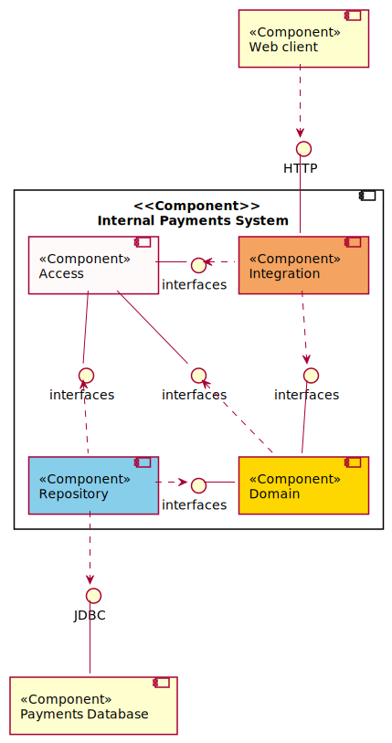

# :bank: Open Demo Bank Architecture Diagrams

## Completed diagrams

- [ ] [Class diagrams](class)
- [ ] [Component diagrams](component)
- [ ] [Object diagrams](object)
- [ ] [Personas](personas)
- [ ] [Sequence diagrams](sequence)
- [ ] [Stories](stories)
- [ ] [Usecase diagrams](usecase)
- [ ] [Userstories](userstories)

## Component diagram

## Class diagram

## Object diagram

