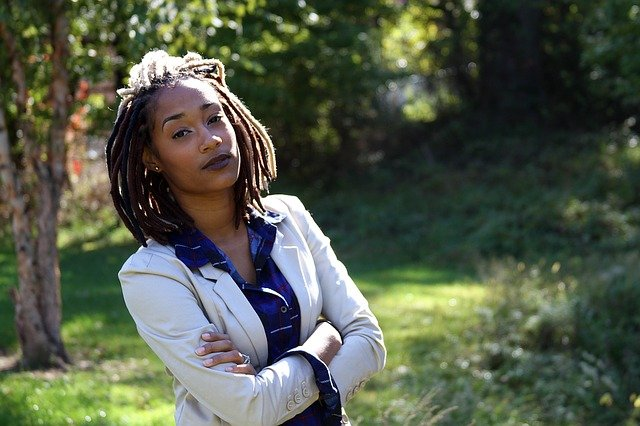

# Personas

## Lana

### Customer

|||
|---|---|
| Persona: | Student in Tartu University|
| Photo: |   |
| Fictional name: | Leyla|
| Job title: | 1st year Software Engineerig Master's Student in University of Tartu |
| Demographics: | - 21 years old   - Lives in the dorms   - No children   - Has BSc in Computer Science |
| Goals and tasks: | - Make money transfers to friends who order group food   - Receive money transfers from parents.   - Receive monthly stipends from the university.   - Keep track of personal spending |
| Environment: | Well-versed in technology, cannot go without her phone for more than 5 minutes. |
| Quote: | "Why are all deadlines on the same day..." |

|||
|---|---|
| Persona: | Entrepreneur  |
| Photo: |   |
| Fictional name: | Eddie (Edward) |
| Job title: | Co-founder of a startup |
| Demographics: | - 46 years old   - Lives with his wife and a dog   - Has a 18 year old daughter who studies abroad |
| Goals and tasks: |  - Receice small loans from his relatives to expand his business   - Pay his debtors back   - Make salary transfers to his employees   - Make money transfers to his daughter's foreign account   - Keep track of personal spending   |
| Environment: | Knows his way around computers, since he has to manage all aspects of his start-up, which has very few employees. |
| Quote: | "If it doesn't scare you, you're not dreaming big enough." |

### Admin

|||
|---|---|
| Persona: | Open Demo Bank administrator|
| Photo: |   |
| Fictional name: | Hendrik |
| Job title: | Administrator for Open Demo Bank online system |
| Demographics: | - 30 years old   - Lives in an apartment   - No children |
| Goals and tasks: |  - Register accounts and users   - Add money to a requested account   - Edit and revert transactions   |
| Environment: | Good with computers and is attentive to details, which comes in handy, since he is dealing with other people's money. |
| Quote: | "Dealing with bank customers is great fun." |

|||
|---|---|
| Persona: | Open Demo Bank administrator |
| Photo: |   |
| Fictional name: | Sam |
| Job title: | Administrator for Open Demo Bank online system |
| Demographics: | - 24 years old   - Lives with his parents   - Has a BSc in Business Administration |
| Goals and tasks: |  - Make sure to input all the data correctly when registering an account   - View all transactions to keep track of the money flow    - See account information to assist customers |
| Environment: | Knows basics of operating computers. Becomes frustrated easily when things do not go his way. |
| Quote: | "But I filled all the fields correctly!" |

## Daichi

### Customer

|||
|---|---|
| Persona: | A customer who opened an account a few days and not familiar with banking system.|
| Photo: |  |
| Fictional name: | Andrew Dorothy|
| Job title: | Grandma lives in USA. |
| Demographics: | - 72 years old   - Lives in Seattle in USA   - Her son helped her to create an account in the bank   - She likes sewing and making cookies |
| Goals and tasks: | - She is not familiar with technologies, so she was happy to use the bank since its interface is more user friendly than other banks. She also wants to send different currency by herself. |
| Environment: | She often sends money to her grandson in Estonia. She struggled figuring out sending different currency on previous bank. |
| Quote: | "What is this this? (pointing to her phone)" |

|||
|---|---|
| Persona: | A customer who often transfer his money with friends.|
| Photo: |  |
| Fictional name: | Yang Yang|
| Job title: | Grandma lives in USA. |
| Demographics: | - 21 years old   - Lives in New York in USA   - He is studying a sociology in bachelor's degree and he has many friends in a college. |
| Goals and tasks: | - He is the type of person who always splits bill and often goes out with friends. Sometimes his friends pay the fee instead, but every weekend, he wants to make all the debt clear, so he wants to use p2p transaction.|
| Environment: | He was tired of using previous bank system because he needed to type required information every time when he transfer money to new people. Fast and easy method to transfer money. |
| Quote: | "I'm sick of typing information every time, why can't it be easier!" |

### Admin

|||
|---|---|
| Persona: | An administrator who loves her work. |
| Photo: |   |
| Fictional name: | Rashida Tanaka|
| Job title: | Grandma lives in USA. |
| Demographics: | - 28 years old.   - Her mother is from Azerbijan and her father is from Japan, and now lives in Estonia.   - Customer satisfaction to her job is very high. |
| Goals and tasks: | - Since she gets lots of request from customers, she wants minimum steps to achieve customers desires such as storing transactions.|
| Environment: | She loves her work so much that she often stays in her office until 7 PM every weekday. She always wants to increase the efficiency. |
| Quote: | "Efficiency is everything!" |

|||
|---|---|
| Persona: | An administrator who is very talkative and sometimes talking too much with customers |
| Photo: |   |
| Fictional name: | David Randorf |
| Job title: | Grandma lives in USA. |
| Demographics: | - 32 years old.   - He didn't expect to work at bank, but he enjoyes talking with customers more than he imagined and he makes great performance as a result. |
| Goals and tasks: | - Since he talks with customers a lot, he often hear some desires from customers. One major thing was to transfer different currency of the money. He brought this up to the board, and this function was implemented to a system. |
| Environment: | His coworkers all love him and respect that he always get valuable and critical ideas from customers. P2p payment was also implemented thanks to his suggestions. He will keep bringing up ideas. |
| Quote: | "Customers are great, coworkers are great, my salary is also getting greater! Let's chat everyone!" |

## Carolin

### Customer

|||
|---|---|
| Persona: | Middle-aged businessman |
| Photo: |   |
| Fictional name: | Steve|
| Job title: | Company manager |
| Demographics: | - 45 years old   - married for 20 years   - 2 children |
| Goals and tasks: | He has been a businessman for half of his life. He knows the value of money and uses bank possibilities to the fullest. He makes a lot of transfers daily and likes to invest his earnings. He has several bank accounts which he uses for different purposes. He also has a lot of connections worldwide, so he sometimes needs to change the currency while making transfers.  |
| Environment: | He’s main tasks include sending emails, making transfers in a bank, writing documents and filling in forms. |
| Quote: | “Bank webpage is always open in my computer…” |

|||
|---|---|
| Persona: | Student in University of Tartu |
| Photo: |   |
| Fictional name: | Mari|
| Job title: | Master’s student in University of Tartu |
| Demographics: | - 22 years old   - in a relationship   - no children   - has BSc in Economics |
| Goals and tasks: | She is a good student and earns a good amount of stipend that she collects into her bank account. She goes to a lot of dates with his boyfriend, which she sometimes pays for. As she has very limited time, she always shops in the web. She is starting to get interesting in investing as well. |
| Environment: | She is good with computers and technology overall. She is young and knows her way around technology. |
| Quote: | “I still have some free time..” |

### Admin

|||
|---|---|
| Persona: | Administrator in Open Demo Bank |
| Photo: |   |
| Fictional name: | Kersti|
| Job title: | Administrator for Open Demo Bank online system |
| Demographics: | - 26 years old   - single   - no children |
| Goals and tasks: | She likes numbers and calculating. She also really enjoys talking to people and helping them. The position as teller seemed exactly the one which would combine these two interests. Her tasks include registering users and their accounts, adding money, modifying transactions.|
| Environment: | She knows how to connect with people. She is good with using computers and systems. She is great at math. |
| Quote: | “I love helping people.” |

|||
|---|---|
| Persona: | Administrator in Open Demo Bank |
| Photo: |   |
| Fictional name: | Kermo|
| Job title: | Administrator for Open Demo Bank online system |
| Demographics: | - 30 years old   - father of a 10 year old |
| Goals and tasks: | He is good at paying attention to details and knows a lot about finance. He is tasks in work are keeping an eye on transactions activity, adding money when requested and registering new customers. He deals with different currency transfers. |
| Environment: | He always have answers to people questions. He is great at working with computers. He has a lot of ideas how to improve the system. |
| Quote: | “My second name is finance.” |

